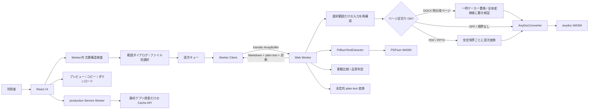
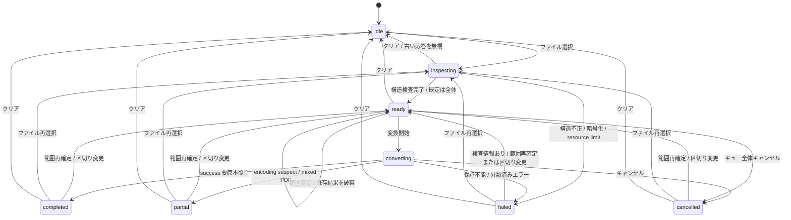

# アーキテクチャ

更新日: 2026-10-06

## 構成

ネットワーク上の変換サービスや文書保存用データベースは存在しない。文書・結果はメモリだけで扱う。production の Service Worker は静的アプリ資産だけを Cache API へ保存する（[ADR-0004](adr/0004-pwa-static-asset-cache.md)）。

## レイヤー責務

| レイヤー | 責務 | 禁止事項 |
| --- | --- | --- |
| UI | ファイル選択、範囲ダイアログ、状態表示、警告、結果操作、Markdown ダウンロード用 frontmatter の付与 | anydoc の直接 import、文書境界の推測、永続化 |
| Queue | 選択順の逐次実行、状態遷移、AbortSignal、再選択時の置き換え | 並列変換 |
| Worker Client | Worker の生成、要求対応、transfer、キャンセル再生成 | 文書本文のログ出力 |
| Worker | 構造検査、選択入力の再構成、安定境界単位の逐次変換と Markdown 区切り、PDF 客観比較、品質診断、plain text 生成、エラーの安全な直列化 | UI 操作、境界の推測、単位の並列変換 |
| Converter | anydoc 初期化・Markdown 変換、PDFium 初期化・ページ別独立抽出 | UI 固有文言、保存、外部通信 |
| Plain text | Markdown AST の決定的な文字列化 | Unicode 正規化、推測補完 |
| Preview | 安全な Markdown 表示 | 外部画像取得、外部リンク生成、raw HTML 実行 |
| PWA | production の SW 登録、manifest、同一オリジン静的資産キャッシュ | 文書・結果・設定の保存、外部オリジン・クエリ付き URL・非 GET のキャッシュ |

## データライフサイクル

1. `File` は利用者が選択した後にメモリで保持する。
2. 選択直後に `arrayBuffer()` を Worker へ transfer し、PDF ページ数、PowerPoint スライド数、Excel シート名、DOCX 明示改ページを検査する。React state は `File`、検査結果、選択値、元ファイル名、`File.lastModified`、状態、変換後の結果をメモリで保持する。外部送信・ストレージ保存は行わない。PDFium は PDF の構造確認時に初期化され、anydoc は初回変換時に初期化される。
3. 逐次処理時に再度 `arrayBuffer()` で読み、Worker 内で選択されたページ／スライド／シートだけの一時入力を再構成する。元の `File` と再構成データは保存しない。
4. ページ区切りがオンの PDF／PowerPoint は、再構成入力を安定境界ごとに分け、同じ Worker と Converter で順番に変換して `\n\n---\n\n` で結合する。オフ、単一単位、境界なし形式は再構成入力を一度だけ変換する。
   DOCX は本文の明示 `w:br type="page"` だけを衝突しない一時マーカーに置換し、文書全体を一度変換する。マーカー数が検出数と一致した場合だけ `---` に戻す。不一致は `postprocessingFailed` として出力しない。
5. PDF は同じ選択入力を PDFium WASM でもページ別に抽出し、文字異常と欠落差を比較する。PDFium fallback も同じページ区切り設定に従う。
6. 異常時は改善が客観確認できた PDFium 出力だけを `partial` として採用する。推測置換や正規化は行わない。
7. Worker は採用 Markdown から plain text を決定的に導出する。Markdown の thematic break は plain text では空行となり、`---` は残さない。
8. コピーとプレビューは `ConversionResult` の Markdown / plain text をそのまま使用する。Markdown ダウンロードだけ、ダウンロード直前に `title` と `originalUpdatedAt` の YAML frontmatter を付与する。plain text ダウンロードには付与しない。
9. コピーは Clipboard API、ダウンロードは短命な Blob URL を使用し、直後に revoke する。
10. 再選択は現在のキューと結果を置き換える。検査世代 ID と変換 run ID で古い応答を無視する。キャンセルでは実行中・待機中だけを cancelled にし、完了済み結果を保持する。
11. クリア、再読み込み、タブ終了で文書と結果の参照を失い、復元経路は持たない。静的資産キャッシュはクリア操作の対象外である。

## 状態モデル

`ready` は UI の `queued`、`completed` は品質 `success` に相当する。構造確認失敗やサイズ超過で検査情報を持たない failed 項目は、範囲変更では回復せずファイルを再選択する。再変換専用ボタンは存在しない。図は項目の状態であり、再選択ではキュー全体を置き換える。

## セキュリティとプライバシー

- CSP は `connect-src 'self'` とし、WASM を含む同一オリジンへの通信を許可し、外部オリジンへの通信を拒否する。
- プレビューの画像は代替テキスト、リンクは通常テキストとして描画する。
- raw HTML をスキップし、スクリプト・iframe・object を生成しない。
- production に限り `/sw.js` を登録し、静的資産のキャッシュを許可する。解析 SDK は使用しない。SW 登録失敗は UI を停止せず、オンラインの変換経路を使用する。
- ソース、出力、ファイル名を console・telemetry・エラー詳細へ送らない。
- Blob URL はダウンロード操作の同期範囲だけで使用して revoke する。
- Markdown パーサーの named-character decoder は Worker 対応 export に固定し、成果物に `document.createElement` が混入していないことを検査する。

## 静的配布

`npm run build` の `dist/` を HTTPS（localhost は開発例外）のオリジン直下で静的配信する。WASM、Worker、JavaScript のハッシュ付き成果物を `dist/assets/`、第三者ライセンスを `dist/licenses/` に含める。`check:dist` は両 WASM、Worker、ライセンス、manifest、アイコンと SW の静的 URL 制限を検査する。

`src/main.tsx` は production の load 後に `/sw.js` を登録する。SW のキャッシュ対象は同一オリジン・クエリなし GET の `/`、`/index.html`、`/manifest.webmanifest`、`/assets/` 直下、アイコン URL に限定する。install 時は HTML / manifest / アイコンを保存し、JS / CSS / Worker / WASM は取得時に保存する。HTML / manifest はネットワーク優先、その他はキャッシュ優先。activate 時は旧 `ldp-static-*` キャッシュを削除する。

未取得 WASM、キャッシュ消去、更新時の旧資産との組み合わせにより、オフライン変換を常時保証しない。現行 SW 登録、manifest の `id` / `start_url` / `scope`、アイコンはルート固定のため、サブパス配信には Vite `base` 以外の修正と検証も必要である。インストール・更新・オフライン・Safari 実機は未検証ゲートとする。
