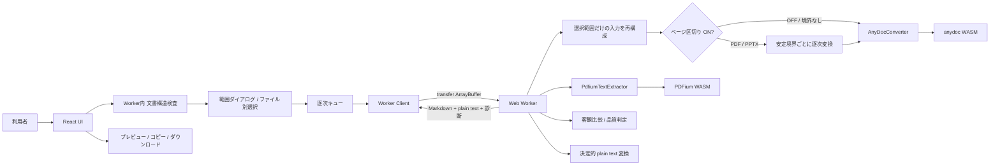
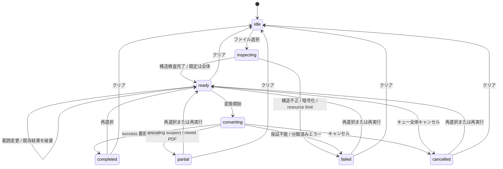

# アーキテクチャ

## 構成

ネットワーク上の変換サービス、データベース、ブラウザ永続ストレージは存在しない。

## レイヤー責務

| レイヤー | 責務 | 禁止事項 |
| --- | --- | --- |
| UI | ファイル選択、範囲ダイアログ、状態表示、警告、結果操作、Markdown ダウンロード用 frontmatter の付与 | anydoc の直接 import、文書境界の推測、永続化 |
| Queue | 追加順の逐次実行、状態遷移、AbortSignal | 並列変換 |
| Worker Client | Worker の生成、要求対応、transfer、キャンセル再生成 | 文書本文のログ出力 |
| Worker | 構造検査、選択入力の再構成、安定境界単位の逐次変換と Markdown 区切り、PDF 客観比較、品質診断、plain text 生成、エラーの安全な直列化 | UI 操作、境界の推測、単位の並列変換 |
| Converter | anydoc 初期化・Markdown 変換、PDFium 初期化・ページ別独立抽出 | UI 固有文言、保存、外部通信 |
| Plain text | Markdown AST の決定的な文字列化 | Unicode 正規化、推測補完 |
| Preview | 安全な Markdown 表示 | 外部画像取得、外部リンク生成、raw HTML 実行 |

## データライフサイクル

1. `File` は利用者が選択した後にメモリで保持する。
2. 選択直後に `arrayBuffer()` を Worker へ transfer し、PDF ページ数、PowerPoint スライド数、Excel シート名を検査する。検査結果、選択値、元ファイル名、`File.lastModified` の数値だけを React state に保持する。文書本文や更新日時を外部へ送信・永続化しない。
3. 逐次処理時に再度 `arrayBuffer()` で読み、Worker 内で選択されたページ／スライド／シートだけの一時入力を再構成する。元の `File` と再構成データは保存しない。
4. ページ区切りがオンの PDF／PowerPoint は、再構成入力を安定境界ごとに分け、同じ Worker と Converter で順番に変換して `\n\n---\n\n` で結合する。オフ、単一単位、境界なし形式は再構成入力を一度だけ変換する。
5. PDF は同じ選択入力を PDFium WASM でもページ別に抽出し、文字異常と欠落差を比較する。PDFium fallback も同じページ区切り設定に従う。
6. 異常時は改善が客観確認できた PDFium 出力だけを `partial` として採用する。推測置換や正規化は行わない。
7. Worker は採用 Markdown から plain text を決定的に導出する。Markdown の thematic break は plain text では空行となり、`---` は残さない。
8. コピーとプレビューは `ConversionResult` の Markdown / plain text をそのまま使用する。Markdown ダウンロードだけ、ダウンロード直前に `title` と `originalUpdatedAt` の YAML frontmatter を付与する。plain text ダウンロードには付与しない。
9. コピーは Clipboard API、ダウンロードは短命な Blob URL を使用し、直後に revoke する。
10. クリア、再読み込み、タブ終了で参照を失い、復元経路は持たない。

## 状態モデル

## セキュリティとプライバシー

- CSP は `connect-src 'self'` とし、WASM の同一オリジン取得だけを許可する。
- プレビューの画像は代替テキスト、リンクは通常テキストとして描画する。
- raw HTML をスキップし、スクリプト・iframe・object を生成しない。
- Service Worker や解析 SDK を登録しない。
- ソース、出力、ファイル名を console・telemetry・エラー詳細へ送らない。
- Blob URL はダウンロード操作の同期範囲だけで使用して revoke する。
- Markdown パーサーの named-character decoder は Worker 対応 export に固定し、成果物に `document.createElement` が混入していないことを検査する。

## 静的配布

`npm run build` の `dist/` を同一オリジンで静的配信する。WASM、Worker、JavaScript のハッシュ付き成果物も `dist/assets/` に含める。サブパス配信を行う場合は Vite `base` を配布先に合わせる。
